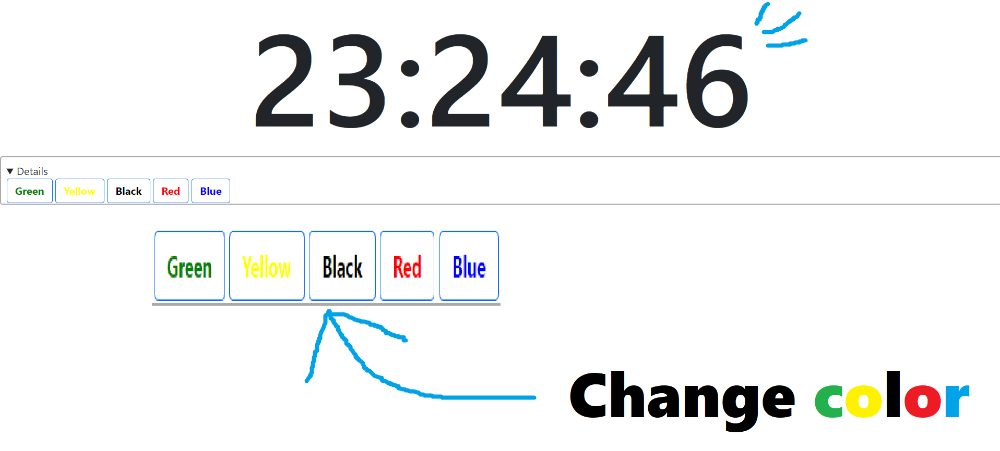

# Clock for JS
It's a sample I made to practice. 
It made by Javascript.

<a href = "http://emc2games.starfree.jp/tool/clock/">Clock is here! click!</a>

# DEMO

# Features
You can CHANGE something!!!  
It can change... 
* Fonts  
* Color  
(if you have idea of Features, plese post issue!)

# Author
* <a href = "https://github.com/tomato645">Github</a>
* <a href = "https://twitter.com/tomato645P">Twitter</a>
* <a href = "https://qiita.com/tomato645">Qiita</a>

# License
"Clock for JS" is under [MIT license](https://en.wikipedia.org/wiki/MIT_License).

<a href = "http://emc2games.starfree.jp/tool/clock/">Clock is here! click!</a>
